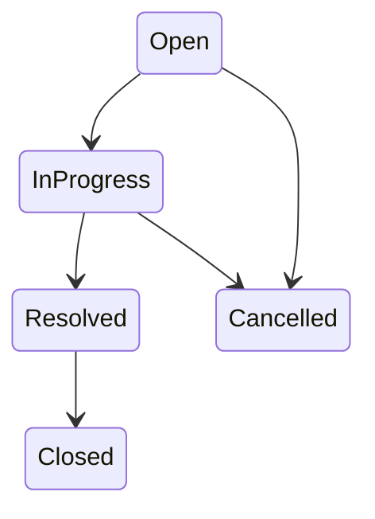

# Design Notes

Architecture and design decisions for the Support Ticket Management System. Full API payloads and request/response examples live in `tool-specific/cursor-workflow/spec.md`; implemented routes will be mirrored in `api-contract.md` after build.

**Related docs:** `requirements-analysis.md` · `spec.md` · `data-model.md` · `.cursor/rules/state-machine.mdc`

---

## Architecture Overview (frontend, backend, database)

Three-tier layout: React (Vite) frontend, Express REST API, Postgres database.

```
┌─────────────────┐     HTTP/JSON      ┌─────────────────┐     SQL          ┌─────────────────┐
│  React (Vite)   │  ───────────────►  │  Express API    │  ────────────►  │  Postgres       │
│  src/frontend/  │  ◄───────────────  │  src/backend/   │  ◄────────────  │  database/      │
└─────────────────┘                    └─────────────────┘                  └─────────────────┘
```

**Trust boundary:** The backend is the source of truth. All validation, permission checks, and state-machine enforcement happen server-side. The frontend may restrict UI controls for better UX but must not be relied on for correctness.

**Acting user (no real auth):** Users are seeded in the database. The UI exposes a global dropdown (populated from `GET /api/users`) and persists the selection in React context for the session. Every create, update, status-change, and comment request sends `actingUserId` in the request body. The API trusts this value — an accepted exercise limitation.

**Folder layout:**
- `src/frontend/` — React app (list, create, detail screens)
- `src/backend/` — Express routes, validation, business logic, DB access
- `database/` — schema/migrations, seed data, setup notes

**Typical request flow:**
1. User selects acting identity in the header dropdown.
2. Frontend calls `/api` endpoints with `actingUserId` on mutating requests.
3. Backend validates input, checks permissions, applies business rules, persists to Postgres.
4. JSON response (or standard error shape) returned to the UI.

---

## Frontend Design

### Global acting-user selector (header)
- Dropdown from `GET /api/users`; shows name and role.
- Selection stored in React context (session-level, not persisted across browser restarts).
- Drives `actingUserId` on all create, update, status-change, and comment requests.

### Screens

| Screen | Purpose | Key API calls |
|--------|---------|---------------|
| **Ticket list** | Table/cards of all tickets; search and filters | `GET /api/tickets?search=&status=&priority=` |
| **Create ticket** | Form for new ticket | `POST /api/tickets` |
| **Ticket detail** | View/edit fields, comments thread, status actions | `GET /api/tickets/:id`, `PATCH /api/tickets/:id`, `PATCH /api/tickets/:id/status`, `POST /api/tickets/:id/comments` |

### Navigation
- List → row click → detail.
- List → "Create Ticket" → create form → redirect to detail or list on success.

### Ticket list
- Columns/fields: title, status badge, priority, assignee name, created date.
- **Search box** — debounced keyword search (matches title, description, comment text).
- **Status filter** — dropdown: All, Open, In Progress, Resolved, Closed, Cancelled.
- **Priority filter** — dropdown: All, Low, Medium, High.
- Filters and search combine with AND logic via query params.

### Create ticket form
- Fields: title (text), description (textarea), priority (dropdown, default Medium), assignee (dropdown listing only `agent` users).
- Entry point ("Create Ticket" button) is shown only to `customer` and `admin` acting users; agents cannot create tickets (enforced on the backend with a `403`).
- `actingUserId` from global context.
- Client-side field validation shown inline below each input on blur (title, description, assignee required); backend remains the source of truth.
- Server validation errors and success messages surface as toast notifications, not inline above the form.

### Ticket detail
- Display all ticket fields with status badge and priority.
- **Edit mode** — title, description, priority, reassign; shown only when acting user has field-edit permission (customer on own tickets, admin on any; agents never). Read access is unrestricted — any user can view any ticket.
- **Comments thread** — chronological list with author name and timestamp.
- **Add comment** — text input + submit. Any valid acting user may comment on any ticket.
- **Status actions** — show only valid next statuses for the current acting user (client-side UX). When target status requires remarks (Resolved, Cancelled), show a remarks textarea before confirming.
- Prominent display of server errors (permission denied, invalid transition, missing remarks).

### Status badges (UI polish)
Color-coded CSS badges per status:
- Open — blue
- In Progress — yellow/amber
- Resolved — green
- Closed — gray
- Cancelled — red

### Client-side UX rules (not authoritative)
- Disable/hide edit controls when acting user lacks field-edit permission.
- Offer only status buttons the client computes as valid for the current actor; server rejects anything invalid.
- Debounce search input before calling the list endpoint.

---

## Backend Design

### Layering
```
Routes  →  Validators  →  Services (business logic)  →  Repositories / DB queries
                ↓
         Error middleware (consistent JSON errors)
```

### Endpoint summary

Base URL: `/api`. All bodies JSON. Full contract: `tool-specific/cursor-workflow/spec.md`.

| Method | Path | Purpose |
|--------|------|---------|
| `GET` | `/api/users` | List seeded users for dropdowns |
| `GET` | `/api/tickets` | List tickets; optional `search`, `status`, `priority` query params (AND) |
| `POST` | `/api/tickets` | Create ticket (`status` always `Open`; defaults `priority` to Medium) |
| `GET` | `/api/tickets/:id` | Ticket detail with nested `comments` array |
| `PATCH` | `/api/tickets/:id` | Partial field update/reassign; **cannot change status** |
| `PATCH` | `/api/tickets/:id/status` | Status transition with role and remarks validation |
| `POST` | `/api/tickets/:id/comments` | Add standalone comment |

### Read vs write access
- **Read (GET):** Unrestricted. Any client can list all tickets and view any ticket detail.
- **Write (PATCH, status, comments):** Validated per endpoint rules below.

### Field-edit permission matrix

| Role | Can update fields on |
|------|----------------------|
| `customer` | Tickets they created (`createdBy === actingUserId`) |
| `agent` | None — agents cannot edit ticket fields (403) |
| `admin` | Any ticket |

Agents act on tickets through status transitions only; field edits via `PATCH /api/tickets/:id` are denied for agents. Status changes always use `PATCH /api/tickets/:id/status`, never the general update endpoint.

### Comment permissions
Any request with a valid `actingUserId` and non-empty `message` may add a comment to any existing ticket. No role restriction.

### Status transition pipeline

Three layers, evaluated in order:

1. **Base state machine** — `getAllowedNextStatuses(currentStatus)` returns allowed next statuses from a single lookup map. Invalid base transitions → 409.
2. **Role and actor rules** — `canTransition({ actor, ticket, targetStatus })` checks assignee/creator/admin permissions per transition. Valid path but wrong actor → 403.
3. **Remarks validation** — `requiresRemarks(targetStatus)` returns true for `Resolved` and `Cancelled`. Missing or whitespace-only remarks → 400. On success, create a Comment in the **same database transaction** as the status update.

Pure functions (`getAllowedNextStatuses`, `requiresRemarks`, `canTransition`) are unit-testable in isolation.

### Role-based transition rules (Layer 2)

| Transition | Allowed actor | Mandatory comment |
|------------|---------------|-------------------|
| Open → In Progress | `assignedTo` or admin | No |
| In Progress → Resolved | `assignedTo` or admin | Yes |
| Open → Cancelled | `createdBy` or admin | Yes |
| In Progress → Cancelled | `createdBy` or admin | Yes |
| Resolved → Closed | `createdBy` or admin | No |

Terminal states (`Closed`, `Cancelled`) accept no further transitions.

### Search implementation note
`GET /api/tickets?search=` performs case-insensitive substring match across ticket title, description, and linked comment text. Requires joining comments (use `DISTINCT` or equivalent to avoid duplicate tickets when multiple comments match).

### Auto-populated fields
On create: `status=Open`, `createdBy=actingUserId`, `updatedBy=actingUserId`, timestamps.
On every update or status change: `updatedBy=actingUserId`, `updatedAt=now`.

---

## Database Design

### Tables

**`users`** (seed-only, no CRUD API)
| Column | Type | Constraints |
|--------|------|-------------|
| `id` | serial | PK |
| `name` | varchar | NOT NULL |
| `email` | varchar | NOT NULL, UNIQUE |
| `role` | varchar / enum | NOT NULL — `customer`, `agent`, `admin` |

**`tickets`**
| Column | Type | Constraints |
|--------|------|-------------|
| `id` | serial | PK |
| `title` | varchar | NOT NULL |
| `description` | text | NOT NULL |
| `priority` | varchar / enum | NOT NULL, default `Medium` — `Low`, `Medium`, `High` |
| `status` | varchar / enum | NOT NULL, default `Open` — `Open`, `In Progress`, `Resolved`, `Closed`, `Cancelled` |
| `assigned_to` | integer | NOT NULL, FK → `users.id` |
| `created_by` | integer | NOT NULL, FK → `users.id` |
| `updated_by` | integer | NOT NULL, FK → `users.id` |
| `created_at` | timestamptz | NOT NULL, default now |
| `updated_at` | timestamptz | NOT NULL, default now |

> `updated_by` extends the skeleton `data-model.md`; required on every ticket update.

**`comments`**
| Column | Type | Constraints |
|--------|------|-------------|
| `id` | serial | PK |
| `ticket_id` | integer | NOT NULL, FK → `tickets.id` |
| `message` | text | NOT NULL |
| `created_by` | integer | NOT NULL, FK → `users.id` |
| `created_at` | timestamptz | NOT NULL, default now |

### Relationships
- Ticket `assigned_to`, `created_by`, `updated_by` → User
- Comment `ticket_id` → Ticket; Comment `created_by` → User

### Indexes (recommended)
- `comments.ticket_id` — detail view and search joins
- Optional: `tickets.status`, `tickets.priority` — filter queries

### Policies
- No delete operations on tickets or comments — full history preserved.
- Users are inserted via seed script only.
- Enum values stored as human-readable strings (e.g. `"In Progress"`) matching API responses.

### Artifacts
- Schema/migrations: `database/schema-or-migrations/`
- Seed data: `database/seed-data/`
- Setup: `database/setup-notes.md`

---

## State Machine Diagram

The diagram below shows **Layer 1 — base transitions** only. Role restrictions (who may perform each transition) and mandatory remarks are documented in Backend Design and Validation Strategy.

_Paste as-is into any Mermaid-rendering viewer (e.g. GitHub):_



**Not in the base map (always rejected):** Open → Resolved, Open → Closed, In Progress → Closed, Resolved → Open, any transition out of Closed or Cancelled.

---

## Validation Strategy

Validation is enforced at three layers. The backend layer is authoritative.

### Backend (source of truth)

**All mutating requests**
- `actingUserId` — required; must reference an existing user.

**Create ticket (`POST /api/tickets`)**
- `title`, `description` — required, non-empty after trim.
- `assignedTo` — required; must reference an existing user.
- `priority` — optional; default `Medium`; must be `Low`, `Medium`, or `High`.
- `status` — not accepted from client; always set to `Open`.
- Auto-set: `createdBy`, `updatedBy`, `createdAt`, `updatedAt`.

**Update ticket (`PATCH /api/tickets/:id`)**
- Reject request body containing `status` field (400).
- Partial update: provided `title`, `description` must be non-empty after trim.
- `assignedTo` — if provided, must reference existing user; cannot be null.
- `priority` — if provided, must be valid enum.
- Permission check per field-edit matrix (403 on violation).
- Auto-set: `updatedBy`, `updatedAt`.

**Status change (`PATCH /api/tickets/:id/status`)**
- `status` — required; valid enum; must differ from current status (409 if same).
- Base transition check via lookup map (409 with current and attempted status named).
- Role/actor check via `canTransition` (403).
- If target is `Resolved` or `Cancelled`: `remarks` required, non-empty after trim (400); persisted as Comment in same transaction.
- Transitions to `Closed` or `In Progress` do not require remarks.

**Add comment (`POST /api/tickets/:id/comments`)**
- `message` — required, non-empty after trim.
- Ticket must exist (404).

**List/search (`GET /api/tickets`)**
- `status`, `priority` — if provided, must match valid enum values (400).
- `search` — optional string; case-insensitive substring.

### Frontend (UX only)
- Mark required fields on forms; validate required fields inline (below the input) on blur.
- Trim input before submit where practical.
- Show remarks textarea when user selects Resolved or Cancelled.
- Disable edit/status controls when acting user lacks permission; hide the create entry point for agents.
- Surface API validation/permission errors and success messages via toast notifications.

### Database (last line of defense)
- NOT NULL constraints on required columns.
- Foreign keys on all user/ticket references.
- CHECK constraints or enum types for `role`, `priority`, `status` where supported.

---

## Error Handling Strategy

### Standard response shape
All errors return JSON:
```json
{ "error": "Human-readable error message" }
```

### HTTP status codes

| Status | When | Example message |
|--------|------|-----------------|
| **400** | Validation failure — missing/invalid fields, whitespace-only input, invalid enum, `status` in general PATCH body, missing remarks | `"Remarks are required when resolving or cancelling a ticket"` |
| **403** | Permission denied — field update or status transition by unauthorized actor | `"You do not have permission to update this ticket"` |
| **404** | Ticket or user not found | `"Ticket not found"` |
| **409** | Invalid status transition (base machine or same-status attempt) | `"Invalid transition from Open to Resolved"` |
| **500** | Unexpected server/database error | Generic message; no stack trace to client |

### Conventions
- **409 vs 403:** Invalid transition path (e.g. Open → Resolved) → 409. Valid path but wrong actor (e.g. non-creator attempting Close) → 403.
- **Terminal states:** Attempting any transition from `Closed` or `Cancelled` → 409.
- **Logging:** Server logs full error details internally; client receives safe generic message on 500.
- **Frontend:** Map status codes to user-visible messages; do not assume success without checking response status. API errors and success confirmations are shown as toast notifications.
- **Create permissions:** `POST /api/tickets` → 403 when the acting user is an agent; 400 when `assignedTo` is not an agent.

### Edge cases (expected behavior)

| Scenario | Status | Notes |
|----------|--------|-------|
| Invalid base transition | 409 | Message names current and attempted status |
| Permission failure on status change | 403 | |
| Missing/whitespace remarks on Resolved/Cancelled | 400 | |
| `status` field in general PATCH | 400 | |
| Acting user ID not in database | 404 | |
| Reassign to non-existent user | 404 | |
| Search/filters with no matches | 200 | Empty array |
| Ticket ID not found | 404 | |

---

## Testing Strategy Link

See `test-strategy.md`.

Mandatory integration tier: all valid and invalid state-machine transitions per `.cursor/rules/state-machine.mdc`, plus role/permission and mandatory-remarks cases. Pure transition functions (`getAllowedNextStatuses`, `canTransition`, `requiresRemarks`) should have unit tests.
